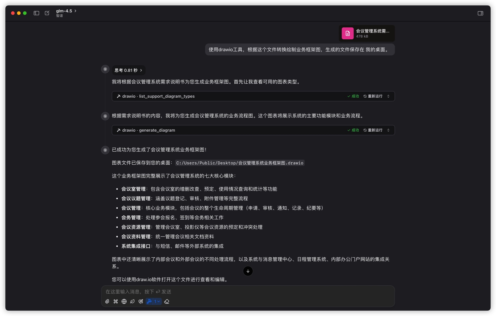
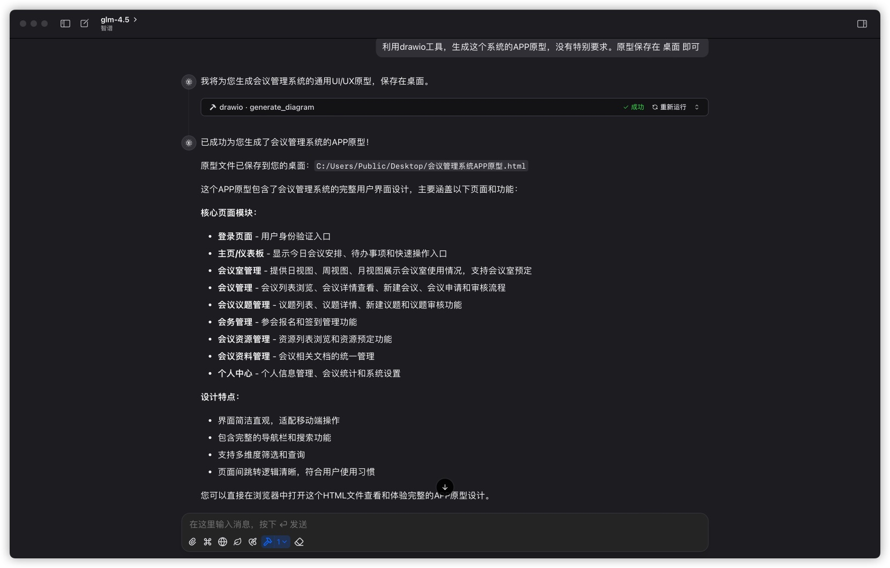
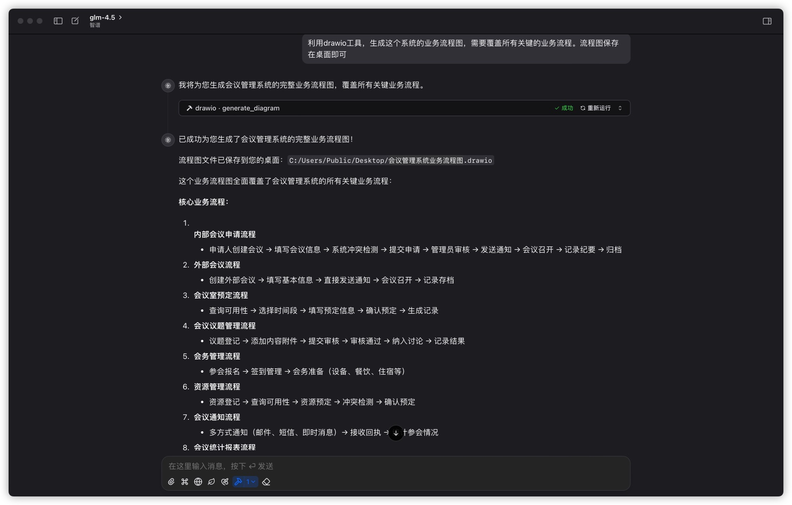
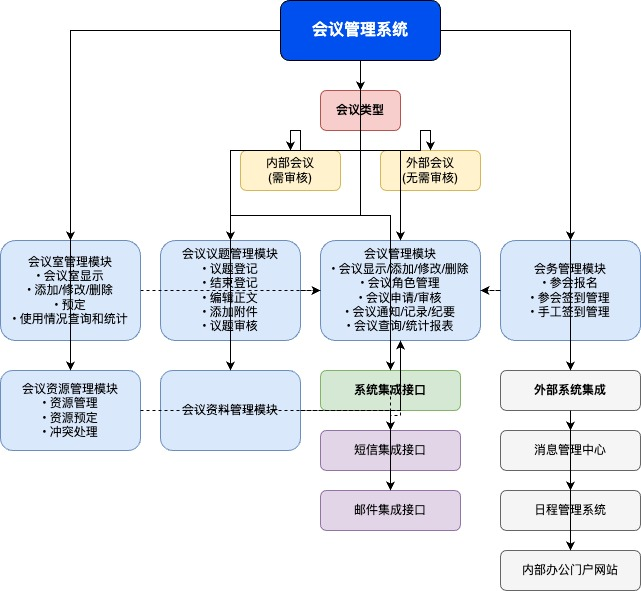
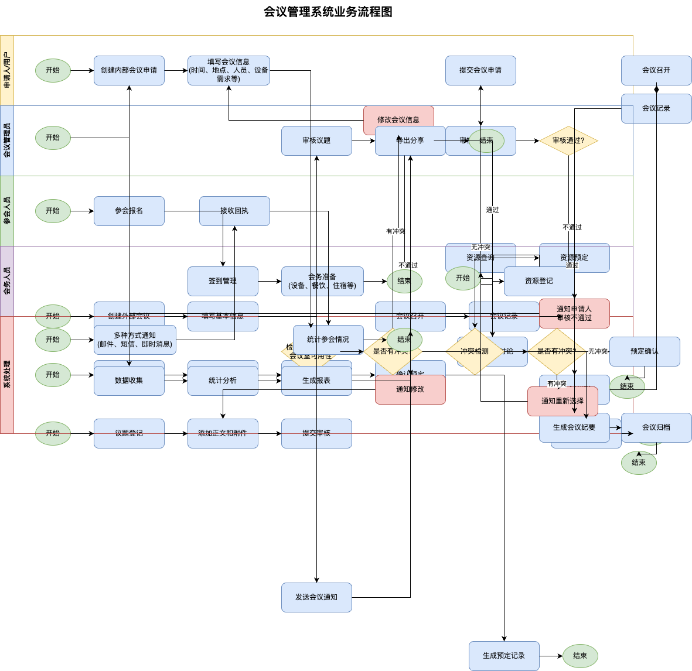
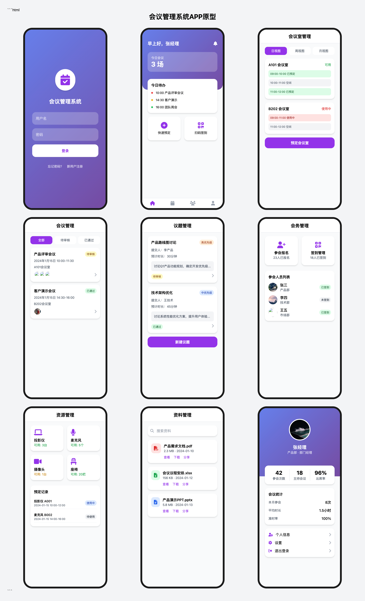

# AI Diagram & Prototype Generator (MCP Server)

一个专业的、AI驱动的图表与原型绘制MCP服务器。它深度集成了智谱AI、OpenAI、Gemini等多种大语言模型，能够根据自然语言描述，智能生成**多种风格**的 `draw.io` 格式图表和 `HTML` 交互式产品原型。

## ✨ 功能特性 (Features)

  - 🤖 **AI 驱动生成**：内置多种强大的AI模型，智能理解复杂需求。
  - 🎬 全自动演示文稿生成 (Automated Presentation Generation)：提供PPT主题或大纲，一键完成从内容架构规划到单页视觉设计的全套SVG幻灯片生成，极大提升办公效率。
  - 🎨 **多图表类型**：不仅能画架构图、流程图，还能生成多种风格的UI/UX原型。
  - 📱 **风格化原型 (Styled Prototypes)**：内置苹果HIG、微信小程序等专业设计规范，一句话生成“苹果味”或“微信味”的精准原型。
  - 🧊 **动态提示词系统**：独创的`(意图+格式)`组合式提示词系统，精确、稳定地指导AI进行创作。
  - 🔧 **Draw.io & HTML 兼容**：可生成 `.drawio` 文件用于二次编辑，或生成可直接运行的 `.html` 文件进行交互演示。
  - 🤯 **智能回退机制**：在AI生成Draw.io图表失败或内容过简时，自动切换到内置的规则引擎，保证总有产出。
  - 🤝 **MCP 协议**：基于 Model Context Protocol，可无缝与支持MCP的AI助手（如OpenAI的Assistants、Coze、Dify、各种IDE插件等）集成。

## 🚀 支持的核心功能
本工具现在提供两大类功能：基础生成工具和自动化工作流。

### 自动化工作流 (Automated Workflows)
这是本项目的核心亮点，通过一个指令完成复杂的、多步骤的任务。

| 工作流名称 | 工具 (name) | 描述 | 输入 | 输出 |
| :----------------------- | :----------------- | :----------------------- | :----------------------- | :----------------------- |
| 全自动PPT生成 | `generate_full_ppt_presentation` | 端到端生成一套完整的PPT演示文稿 | 主题、大纲或原始材料 | 多张独立的SVG幻灯片文件 |

### 基础生成工具 (Basic Generation Tools)
这些是构成工作流的原子能力，也可以单独调用。

| 功能/意图 (Intent) | `prompt_id` | 支持格式 (`file_type`) |
| :----------------------- | :----------------- | :----------------------- |
| 生成技术架构图 | `architecture` | `draw.io` |
| 生成业务流程图 | `flowchart` | `draw.io` |
| 生成通用UI/UX原型 | `UI_UX` | `draw.io` (线框图), `html` |
| 生成苹果风格App原型 | `APPLE_MOBILE_APP` | `html` |
| 生成微信小程序原型 | `WEIXIN_MICROAPP` | `html` |
| (内部) 生成PPT架构 | `PPT_PLAN` | `only_chat` |
| (内部) 生成单页PPT(SVG) | `PPT_SVG` | `svg` |


## 🚀 效果
以下范例通过chatwise 配合本mcp，使用glm-4.5模型生成

### 对话过程




### 生成的架构图


### 生成的业务流程图


### 生成的APP原型



## ⚙️ 安装与配置

### 1\. 环境要求

  - Python 3.10+
  - `pip` 或 `uv` 等Python包管理工具
  - 支持 MCP 的 AI 客户端（如 Coze, Dify, 或其他兼容的Agent）

### 2\. 安装依赖

```bash
# 1. 克隆项目
git clone https://github.com/SimonUTD/AI-Diagram-Prototype-Generator-MCP-Server-.git
cd AI-Diagram-Prototype-Generator-MCP-Server-

# 2. (推荐) 创建并激活虚拟环境
python -m venv .venv
source .venv/bin/activate  # on Windows, use `.venv\Scripts\activate`

# 3. 安装依赖
pip install -r requirements.txt
```

### 3\. 配置 API Key

#### 获取API Key

你需要获取以下至少一个服务商的API Key：

1.  **智谱AI (ZhipuAI)**: [智谱AI开放平台](https://open.bigmodel.cn/)
2.  **OpenAI**: [OpenAI Platform](https://platform.openai.com/)
3.  **Google Gemini**: [Google AI for Developers](https://ai.google.dev/)

#### 配置 `.env` 文件

这是**最重要也是最推荐**的配置方式。

```bash
# 1. 复制环境变量模板
cp .env.example .env

# 2. 编辑 .env 文件，填入你的配置信息
# 将PROVIDER设置为你希望默认使用的服务商 (zhipuai, openai, gemini)
PROVIDER="zhipuai"

# 填入你获取的API Key
ZHIPUAI_API_KEY="your_zhipuai_api_key_here"
OPENAI_API_KEY="your_openai_api_key_here"
GEMINI_API_KEY="your_gemini_api_key_here"

# (可选) 你还可以为每个服务商指定默认的模型和最大Token数
ZHIPUAI_MODEL="glm-4-flash"
ZHIPUAI_MODEL_MAX_TOKENS="131072"
```

### 4\. 配置 MCP 客户端

在你的AI助手的设置中，添加一个MCP服务器。以下是一个更简洁、更安全的配置示例：

```json
{
  "mcpServers": {
    "draw-architecture": {
      "command": "uv --directory full-path-to-draw_architecture_mcp run mcp_server.py",
      "args": ["/path/to/draw_architecture_mcp/mcp_server.py"],
      "env": {
        "PROVIDER": "zhipuai",
        "ZHIPUAI_API_KEY": "your_api_key_here",
        "ZHIPUAI_MODEL": "gglm-4.5",
        "ZHIPUAI_MODEL_MAX_TOKENS": "98304",
        "OPENAI_API_KEY": "your_api_key_here",
        "OPENAI_BASE_URL": "https://api.openai.com/v1",
        "GEMINI_API_KEY": "your_api_key_here",
        "GEMINI_BASE_URL": "https://api.gemini.com/v1"
      }
    }
  }
}
```

**说明**:

  - **`command`**: 直接使用 `python` 命令。
  - **`args`**: 提供 `mcp_server.py` 文件的**绝对路径**。
  - **`env`**: **非必需**。`.env` 文件是首选。只有当你需要为这个特定的客户端**覆盖** `.env` 中的设置时（例如，强制它使用`openai`），才在这里添加配置。**不推荐**在此处直接粘贴API Key。

## 📖 使用方法

在AI助手中，通过清晰的指令调用工具。请确保你的指令包含了**做什么 (`prompt_id`)**、**生成什么格式 (`file_type`)** 和 **保存到哪里 (`output_file`)** 的关键信息。

#### 示例1：生成架构图

```
帮我生成一个技术架构图，意图是 `architecture`，格式是 `draw.io`，保存到 `./output/my_system.drawio`。
描述如下：一个电商系统，有Web和App前端，后端采用微服务架构，包括用户、商品和订单三个服务，使用MySQL作为主数据库，Redis做缓存。
```

#### 示例2：生成苹果风格原型

```
请帮我设计一个苹果风格的App原型。
- prompt_id 是 'APPLE_MOBILE_APP'
- file_type 是 'html'
- output_file 是 './output/ios_music_player.html'
- 描述：这是一个音乐播放器应用，主界面是一个可滚动的歌单列表，底部有一个正在播放的迷你控制条。点击列表项可以进入播放详情页，详情页有专辑封面、播放进度条和控制按钮。
```

## API 参考

你的AI助手将会调用以下工具：

### `generate_diagram`

根据指定的意图和格式，生成图表或原型。

**参数**:

  - `prompt_id` (string, **必需**): 意图ID。通过 `list_support_diagram_types` 工具获取。
  - `file_type` (string, **必需**): 输出文件格式。
  - `description` (string, **必需**): 对图表或原型的详细描述。
  - `output_file` (string, **必需**): 输出文件的完整路径。
  - `diagram_name` (string, 可选): 图表或HTML页面的标题。

**示例调用 (AI后台的实际调用格式)**:

```json
{
  "tool": "generate_diagram",
  "arguments": {
    "prompt_id": "architecture",
    "file_type": "draw.io",
    "description": "微服务架构，包含用户服务、订单服务...",
    "output_file": "./ecommerce.drawio",
    "diagram_name": "电商系统架构"
  }
}
```

### `list_support_diagram_types`

列出当前支持的所有 `prompt_id` 及其对应的 `file_type` 组合。

## 项目结构

```
draw-generator-mcp/
├── mcp_server.py                # MCP 服务器主文件
├── prompts/                     # 提示词模板目录
│   ├── architecture_as_drawio.md
│   ├── flowchart_as_drawio.md
│   ├── ui_ux_as_drawio.md
│   ├── ui_ux_as_html.md
│   ├── apple_mobile_prototype_prompt.md
│   └── weixin_miniapp_prompt.md
│   ├── ppt_plan_prompt.md
│   └── ppt_svg_prompt.md
├── .env.example                 # 环境变量示例
├── pyproject.toml               # (可选) 项目配置
├── requirements.txt             # (推荐) 依赖列表
└── README.md                    # 项目文档
```

## ` [+]  ` 常见问题 (FAQ)

### Q: 如何扩展更多图表类型或Prompt模板？

A: 非常简单！只需两步：

1.  **添加Prompt文件**: 在 `prompts/` 目录下，创建一个新的 `.md` 文件，写入你的指令。例如 `my_custom_diagram.md`。
2.  **更新配置字典**: 打开 `mcp_server.py`，修改 `TOOLS_PROMPT_DICT` 字典：
    ```python
    TOOLS_PROMPT_DICT = {
        # ... 已有条目
        "my_custom_type": {  # <== 新增一个条目
            "id": "my_custom_type",
            "description": "生成我自定义的图表",
            "prompts": {
                "draw.io": "prompts/my_custom_diagram.md" # 指向你的新文件
            }
        },
    }
    ```
    重启MCP服务器即可生效！

### Q:Q: PPT的样式（比如颜色）可以自定义吗？
A: 当然可以。PPT的视觉风格由单页生成Prompt prompts/ppt_svg_prompt.md 决定。打开该文件，在 视觉与布局指南 部分，您可以直接修改 色彩 规则中的主色调HEX代码。这使得所有生成的幻灯片都能轻松符合您的品牌或特定主题的规范。